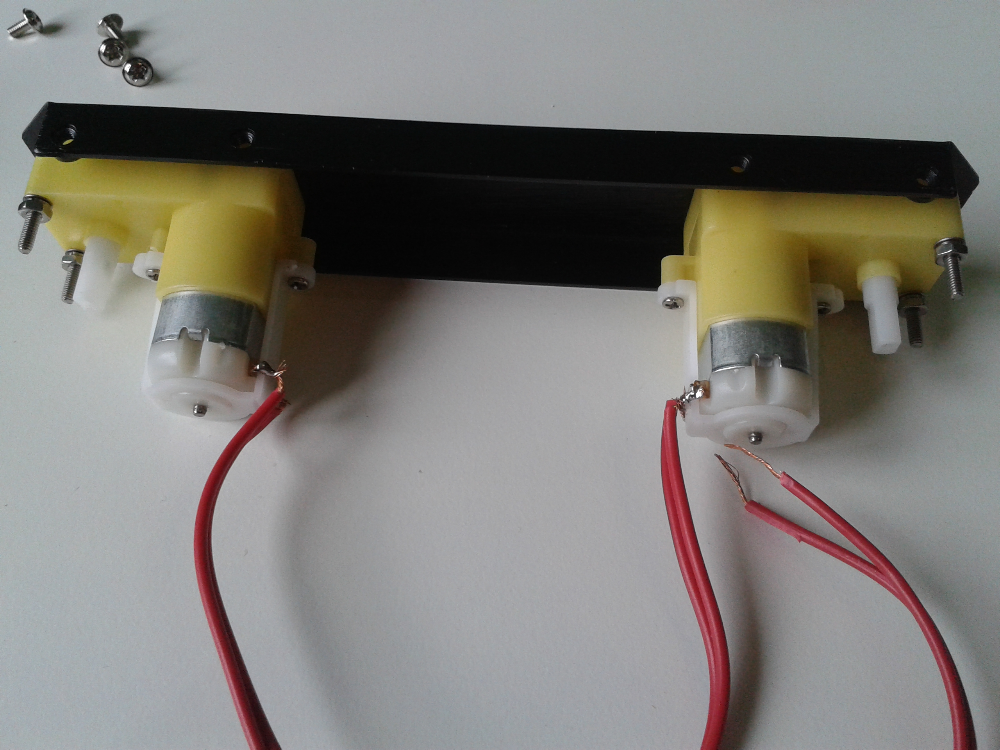

# Motors Assembly

You have to repeat this process twice: you should screw two motors to each side plate. Be careful with the **position of the motors** (looking to the inside part). Also, **note the order** when screwing: first the washer, second the spring washer and last the nut.

After having done this, take eigth pieces of wire and tie them to the metal-holes in the motors(two wire pieces for each motor). We have tied them in the following order: the black wire on the up hole and down the red wire.Then,for better fixation, **weld the wires** with a bit of tin.You can get support in [this video](https://www.youtube.com/watch?v=IU9lQ-wKoXo).

We are now going to **connect the ESC** (Electronic Speed control) to the motors, We have choose The *TURNIGY BRUSHED 20A ESC*. We will use one ESC for the rigth side motors and another one for the left side ones. This is because the APMrover2 works on **skid-steer mode**:

Skid-steer loaders are typically four-wheel vehicles with the wheels mechanically locked in synchronization on each side, and the left-side drive wheels can be driven independently of the right-side drive wheels. The wheels typically have no separate steering mechanism and hold a fixed straight alignment on the body of the machine. By turning the left and right wheel pairs at different speeds, the machine turns by skidding, or dragging its fixed-orientation wheels across the ground.

The  wires attached to the *motors on the right* should be welded to one of the ESC connectors: the red wires from the motors with the red wire from the ESC and the black wires from the motors with the black wire of the ESC. The same should be done for the *left side motors*

Then we need to **collect together** all the red wires comming from the ESC on one side, and all the black wires on the other.They will be the wires connected to the battery.
You can gather them together, following the example in the images below:

You should get a **positive end (+)** formed from the red wires and a **negative end (-)** from the black wires, that will be connected to the battery.

