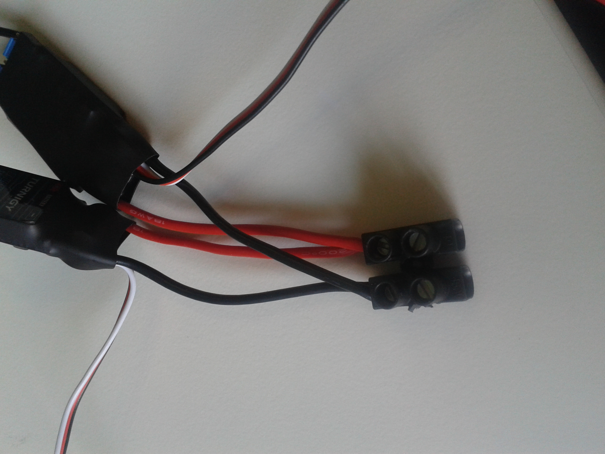
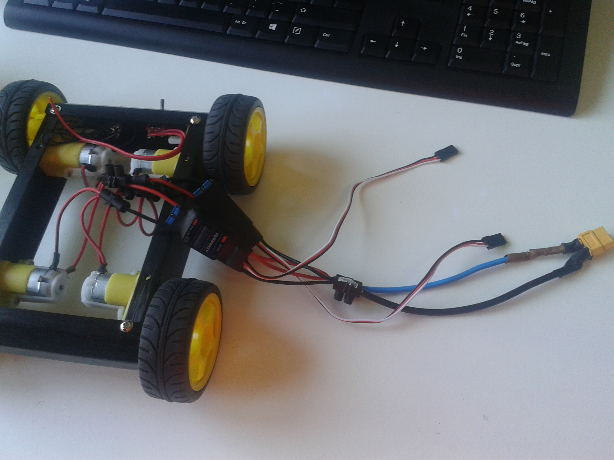

# Motors and ESC Assembly

Hay que repetir el proceso dos veces: debes atornillas los motores a cada placa lateral. Poner especial atención a la **posición de los motores** (mirando a la parte interior). Además, **ten en cuenta** cuando atornilles: primero la arandela, segundo la arandela elástica y por último la tuerca dura. 

Después de haver hecho esto, toma 8 trozos de cable y metelos por los agujeros (dos trozos de cable por cada motor). Se introducen en el orden siguiente: el cable negro en el agujero de arriba y el de abajo el cable rojo. Entonces, para un mejor fijación **suelde los cables** con un poco de estaño. También puede apoyarse en el siguiente [vídeo](https://www.youtube.com/watch?v=IU9lQ-wKoXo).

Vamos a **conectar el ESC** (Electronic Speed control) a los motores, tenemos que el  *TURNIGY BRUSHED 20A ESC*. Usaremos un ESC para los motores del lado derecho y otro para los del lazo izquierda. Esto es porque el APMrover2 funciona en el **modo de dirección deslizante**:

*Skid-steer loaders* son tipicamente vehículos de 4 ruedas con las rudas bloqueadas mecánicamente en la sincronización de cada lado, y las ruedas de tracción del lado izquierdo se puede conducir de forma independiente de las ruedas motrices del lado derecho. Las ruedas normalmente no tienen ningún mecanismo de dirección independiente y mantienen una alineación recta en el cuerpo de la máquina. Girando los pares de ruedas izquierda y derecha a diferentes velocidades, el vehículo gira por el arrastre, o arrastrando sus ruedas de orientación fijo a través del suelo.

Los cables conectados *a los motores de la derecha* debe ser soldado a unos de los conectores de la ESC: los cables rojos de los motores con el cable rojo de la ESC y los cables negros de los motores con el cable negro de la ESC. El mismo debe hacerse para los motores del lazo izquierdo.

Teneos que **juntar** todos los cables rojos procedentes de la ESC en un lado, y todos los cables negros por otro lado. Ellos serán los cables conectados a la batería.

Puedes reunirlos, siguiendo el ejemplo de las imágenes a continuación:

Debes obtener un **extremo positivo (+)** formado a partir de los cables rojos y un **extremo negativo (-)** a partir de los cables negros, que se conectaran a la bateria. El resultado debe ser similar a la siguiente imagen:

